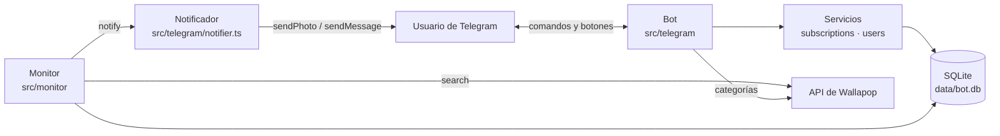
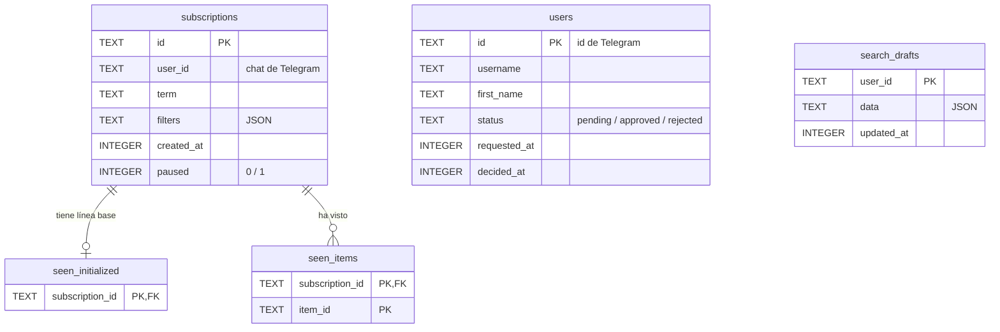
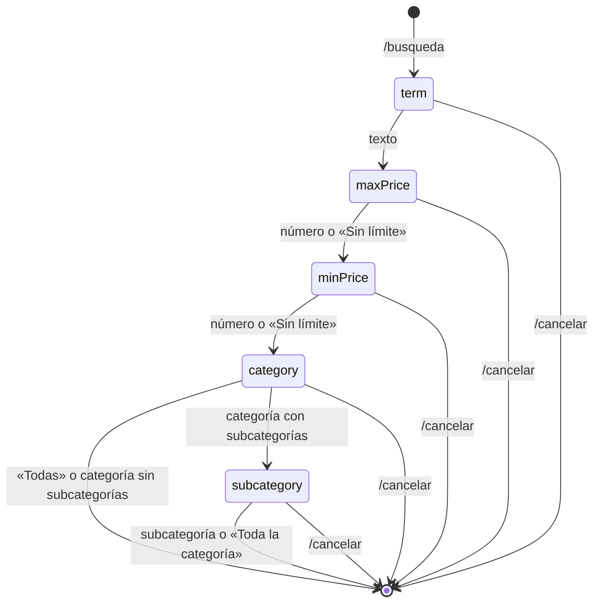

# Arquitectura

Documento para quien vaya a modificar el código. Para la idea general del producto, ver [concept.md](concept.md).

## Visión general

Un único proceso de Node.js (TypeScript) con dos partes que comparten la misma base de datos SQLite:

- **El bot de Telegram** (grammY, *long polling*): atiende los comandos y botones de los usuarios.
- **El monitor**: cada `intervalMs` consulta Wallapop por cada búsqueda activa y envía los anuncios nuevos por Telegram.



## Estructura de carpetas

```
src/
  index.ts                 punto de entrada: crea todo y arranca bot + monitor
  config.ts                lee config.json, .env y variables de entorno
  types.ts                 tipos de dominio: Subscription, User, SearchDraft
  wallapop/
    client.ts              search(), searchItems(), itemUrl()
    categories.ts          árbol de categorías con caché (CategoryCatalog)
    types.ts               SearchFilters, WallapopItem, WallapopSearchResponse
  monitor/
    monitor.ts             Monitor (bucle periódico) y queryKey()
  storage/
    types.ts               interfaces: SubscriptionStore, SeenStore, UserStore, DraftStore
    sqlite.ts              implementaciones SQLite de esas interfaces
    database.ts            openDatabase(), migraciones, transaction()
  subscriptions/
    service.ts             SubscriptionService: añadir, pausar, reanudar, eliminar
  users/
    access.ts              AccessService: quién puede usar el bot
  telegram/
    bot.ts                 createBot(): monta los middlewares y los comandos
    access.ts              /start, /ayuda, /id, solicitudes de acceso, /usuarios
    new-search.ts          /busqueda paso a paso y /cancelar
    my-searches.ts         /busquedas con botones de pausar/reanudar y eliminar
    notifier.ts            envía los anuncios nuevos (foto + pie)
    format.ts              textos: precios, resúmenes, pies de foto, escape HTML
    deps.ts                BotDeps, textos de ayuda y utilidades compartidas
  cli/
    args.ts                parseCliArgs(): término + --min/--max/--category/--subcategory
    search.ts              npm run search: una búsqueda suelta, para depurar
    subscriptions.ts       npm run cli: gestionar suscripciones desde la terminal
test/                      misma estructura que src/
docs/                      esta documentación
config.json                configuración no secreta
.env                       secretos (no se sube al repositorio); ver .env.example
```

### Dependencias entre capas

Cada capa solo usa las de abajo. `wallapop/` y `storage/` no saben nada de Telegram, y el monitor no sabe nada de Telegram más allá de la función `notify` que recibe.

```
index.ts
 ├─ telegram/ ──┬─ subscriptions/ ─┐
 │              └─ users/ ─────────┼─ storage/
 ├─ monitor/ ──────────────────────┘
 └─ wallapop/  (lo usan monitor/ y telegram/)
```

## El monitor

[src/monitor/monitor.ts](../src/monitor/monitor.ts). En cada comprobación (`runOnce()`):

1. Pide las suscripciones **activas** (`listActive()`).
2. Las agrupa por `queryKey(term, filters)`: término normalizado (minúsculas, espacios colapsados) + filtros ordenados. Las del mismo grupo comparten petición.
3. Por cada grupo, hace **una** llamada a `searchFn` (por defecto `searchItems`), con `requestDelayMs` de pausa entre grupos.
4. Por cada suscripción del grupo:
   - si no tiene línea base (`seen.isInitialized`), marca todos los ids como vistos y no notifica;
   - si la tiene, filtra los no vistos, los ordena del más antiguo al más reciente, llama a `notify` y **después** los marca como vistos.

Decisiones:

- **Notificar antes de marcar como vistos**: si el envío falla, los anuncios se reintentan en la siguiente comprobación (entrega *al menos una vez*). Si un lote falla a medias, los ya enviados se reenvían.
- **Errores aislados**: un fallo en una búsqueda o en un envío se informa por `onError` y no detiene al resto.
- **Sin solapamientos**: la siguiente comprobación se programa con `setTimeout` al terminar la actual, no con `setInterval`.
- `stop()` espera a que termine la comprobación en curso (cierre ordenado con `SIGINT`/`SIGTERM`).

## Almacenamiento

SQLite con `node:sqlite` (incluido en Node, sin dependencias nativas). El código de negocio solo depende de las interfaces de [src/storage/types.ts](../src/storage/types.ts), así que cambiar a otra base de datos supone implementarlas de nuevo sin tocar el monitor ni el bot.

### Esquema



- `seen_items` y `seen_initialized` se borran en cascada al eliminar la suscripción (`ON DELETE CASCADE`, con `PRAGMA foreign_keys = ON`).
- `seen_items` se limita a `maxSeenPerSubscription` filas por suscripción. El orden de antigüedad lo da el `rowid`: `INSERT OR REPLACE` reinserta un id ya visto con un `rowid` nuevo, así que cuenta como reciente.
- `users` y `search_drafts` no tienen clave foránea con `subscriptions`: un usuario puede existir sin búsquedas y viceversa (el CLI puede crear suscripciones para cualquier id).
- Modo **WAL** y `busy_timeout`: permiten que el bot y el CLI accedan a la vez.

### Migraciones

[src/storage/database.ts](../src/storage/database.ts) contiene la lista `MIGRATIONS`. La versión aplicada se guarda en `PRAGMA user_version` y `openDatabase()` ejecuta las que falten, cada una en su transacción.

Para cambiar el esquema: **añadir** una migración al final de la lista. Nunca modificar una ya existente, porque las bases de datos que ya la aplicaron no la volverán a ejecutar.

### Inyección SQL

Todas las consultas con datos usan *prepared statements* (`prepare()` con `?`). La única interpolación es `PRAGMA user_version = ${version}`, con un número interno, porque `PRAGMA` no admite parámetros. Cualquier consulta nueva debe pasar los valores como `?`.

## El bot

[src/telegram/bot.ts](../src/telegram/bot.ts) monta los middlewares de grammY en este orden:

1. **`autoRetry`**: reintenta las llamadas cuando Telegram responde 429 (demasiadas peticiones).
2. **Solo chats privados**: el resto de actualizaciones se ignoran, porque el id del chat se usa como id del usuario.
3. **`accessComposer`**: `/start`, `/ayuda`, `/help`, `/id`, solicitud de acceso, y para el administrador `/usuarios` y los botones de aceptar/rechazar. Accesible sin estar aprobado.
4. **`requireApproved`**: corta todo lo demás si el usuario no tiene acceso.
5. **`newSearchComposer`**: `/busqueda`, `/cancelar` y los pasos del asistente.
6. **`mySearchesComposer`**: `/busquedas` y sus botones.
7. Cualquier otro mensaje: muestra la ayuda.

### Asistente de `/busqueda`

Máquina de estados guardada en `search_drafts` (sobrevive a reinicios):



Los botones comprueban que el borrador esté en el paso que les corresponde; si no (un botón de un mensaje antiguo), responden que el paso ya no está activo.

### `callback_data` de los botones

| Prefijo | Ejemplo | Quién |
|---|---|---|
| `access:request` | | cualquiera |
| `access:approve:<userId>` / `access:reject:<userId>` | `access:approve:123` | solo el administrador |
| `wiz:skip`, `wiz:cat:<id\|any>`, `wiz:sub:<id\|all>` | `wiz:cat:24200` | usuario con borrador en ese paso |
| `sub:pause\|resume\|delete:<subscriptionId>` | `sub:pause:6f1c…` | solo el dueño de la suscripción |

Telegram limita `callback_data` a 64 bytes; el más largo (`sub:resume:` + UUID) ocupa 47.

### Notificaciones

[src/telegram/notifier.ts](../src/telegram/notifier.ts) implementa el tipo `Notifier` del monitor:

- Envía `sendPhoto` con la primera imagen (`urls.big`) y el pie de [format.ts](../src/telegram/format.ts): búsqueda, título, precio y enlace.
- Si no hay imagen o Telegram responde 400 al usarla, envía solo el texto.
- Si responde 403 (bot bloqueado), llama a `onUnreachable`, que pausa todas las búsquedas del usuario, y no lanza error para no reintentar sin fin.
- Cualquier otro error se propaga al monitor, que reintenta en la siguiente comprobación.

## Configuración

| Origen | Contenido |
|---|---|
| `config.json` | URLs y parámetros de la API de Wallapop, ruta de la base de datos, tiempos del monitor |
| `.env` / variables de entorno | `TELEGRAM_BOT_TOKEN`, `TELEGRAM_ADMIN_ID` (obligatorias), `DATABASE_PATH` (opcional, tiene prioridad sobre `config.json`) |

`.env` se carga con `process.loadEnvFile()` en [config.ts](../src/config.ts); las variables ya definidas en el entorno tienen prioridad.

Valores del monitor:

| Clave | Por defecto | Qué controla |
|---|---|---|
| `intervalMs` | 60000 | Espera entre el final de una comprobación y el inicio de la siguiente |
| `requestDelayMs` | 2000 | Pausa entre peticiones a Wallapop dentro de una comprobación |
| `maxSeenPerSubscription` | 200 | Ids recordados por suscripción. Debe ser bastante mayor que 40 (el tamaño de página de Wallapop) para no repetir avisos cuando un anuncio sale y vuelve a entrar en la página |

Una vuelta completa dura aproximadamente `(búsquedas distintas − 1) × requestDelayMs + intervalMs`.

## Comandos de desarrollo

| Comando | Qué hace |
|---|---|
| `npm start` | Arranca bot + monitor con `tsx` (sin compilar) |
| `npm run build` | Compila a `dist/`; se ejecuta con `node --disable-warning=ExperimentalWarning dist/index.js` |
| `npm test` | Ejecuta todos los tests (`node:test`) |
| `npm run typecheck` | Comprueba tipos de `src/` y `test/` |
| `npm run search -- 3ds --max 100` | Hace una búsqueda y muestra la respuesta JSON |
| `npm run cli -- <add\|list\|pause\|resume\|remove>` | Gestiona suscripciones desde la terminal |

## Despliegue

- **[Dockerfile](../Dockerfile)** en dos etapas: la primera instala todas las dependencias y compila; la segunda solo lleva Node 24 Alpine, las dependencias de producción, `dist/` y `config.json`. Se ejecuta como el usuario `node`, con `DATABASE_PATH=/data/bot.db` en un volumen y `TZ=Europe/Madrid`.
- **[.dockerignore](../.dockerignore)** excluye `.env`, `data/` y cualquier `*.db`: los secretos y los datos de los usuarios nunca entran en la imagen. Los secretos se pasan al arrancar con `env_file`.
- **[compose.yaml](../compose.yaml)** arranca el servicio con `restart: unless-stopped` e `init: true`, para que `docker stop` llegue como `SIGTERM` al proceso de Node y se cierre ordenadamente. `DATABASE_PATH` se fija en `environment`, que tiene prioridad sobre `.env`, para que la base de datos esté siempre en el volumen.
- **[.github/workflows/release.yml](../.github/workflows/release.yml)**: al subir una etiqueta `v*`, ejecuta `typecheck` y los tests, publica la imagen `linux/amd64` + `linux/arm64` en `ghcr.io/<usuario>/<repo>` (etiquetas `X.Y.Z`, `X.Y` y `latest`) y crea la Release con el comando `docker pull`.

## Tests

- Runner nativo `node:test`, ejecutado con `tsx`. Sin dependencias de test.
- No hacen peticiones reales: `fetch` se sustituye por un mock y Wallapop por una función de búsqueda falsa.
- El almacenamiento usa SQLite en memoria (`:memory:`), nuevo en cada test, con [test/storage/create-stores.ts](../test/storage/create-stores.ts).
- [test/telegram/bot.test.ts](../test/telegram/bot.test.ts) prueba el bot completo: intercepta las llamadas a la API de Telegram con un *transformer* de grammY y le pasa actualizaciones simuladas con `bot.handleUpdate()`.

## Cómo extender

**Un filtro nuevo de Wallapop**
1. Añadirlo a `SearchFilters` en [src/wallapop/types.ts](../src/wallapop/types.ts).
2. Añadir su nombre de parámetro en `api.filterParams` de `config.json`.
3. Si se pide por el bot: un paso nuevo en `DraftStep` y su manejo en [new-search.ts](../src/telegram/new-search.ts); y su texto en `formatSubscription`.

`queryKey` y el almacenamiento (los filtros se guardan como JSON) no necesitan cambios.

**Un comando nuevo**
Añadirlo al *composer* que corresponda (o a uno nuevo registrado en `createBot`), a `BOT_COMMANDS` en [bot.ts](../src/telegram/bot.ts) y a los textos de ayuda en [deps.ts](../src/telegram/deps.ts). Si va antes de `requireApproved`, lo podrá usar cualquiera.

**Otra base de datos**
Implementar las cuatro interfaces de [src/storage/types.ts](../src/storage/types.ts) y crearlas en `index.ts` en lugar de las de SQLite. `SubscriptionStore.remove` debe borrar también los anuncios vistos de la suscripción.
